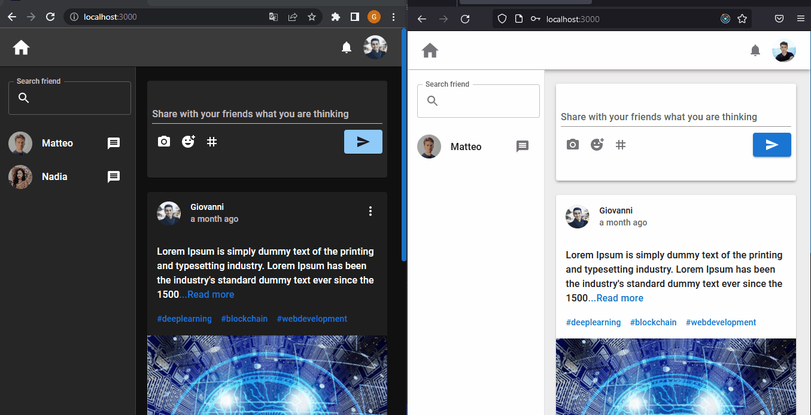
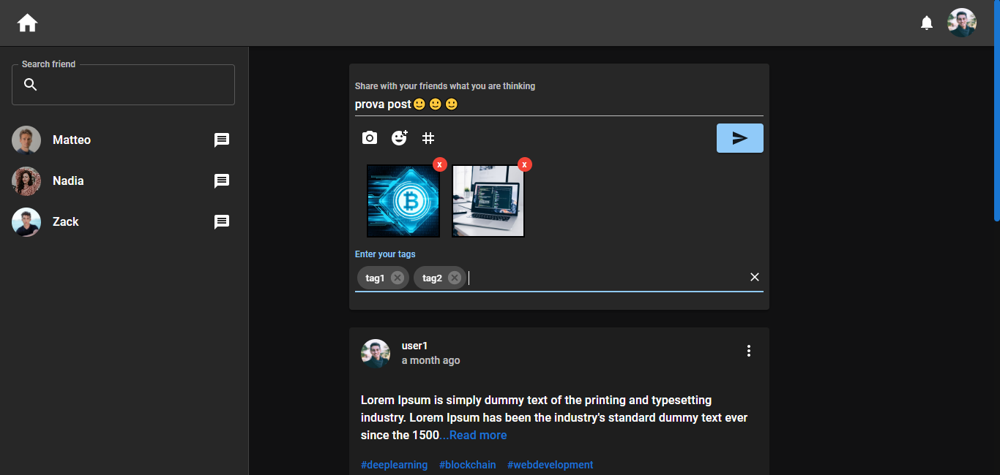
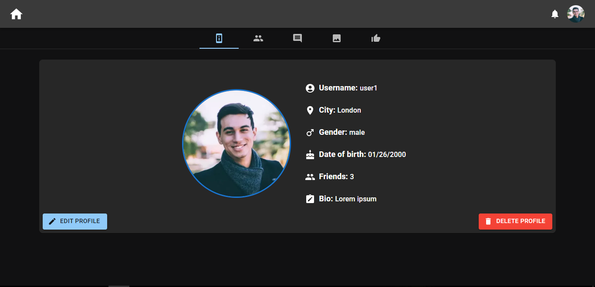
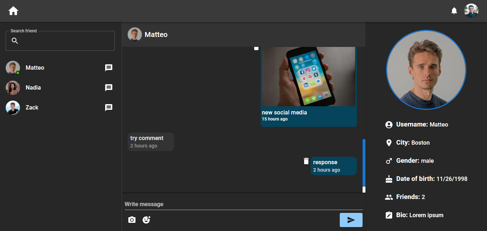

Fake Social project
This is the project I made for the final project start2impact .

## :clipboard: Table of Content
* Description
* Installation
* Built
* Packages
* Author
* License

## :memo: Description
Through this application you can send friend requests to other users and interact with them by commenting on their posts or by sending them private messages. You will also be able to access the profiles of each user showing their respective posts, friends and likes.

To access you can use the following credentials:

* email: fake-email@gmail.com
* password: qwerty

[click to watch](https://gv-fake-social.onrender.com)

&nbsp;&nbsp;&nbsp;&nbsp;
&nbsp;&nbsp;&nbsp;&nbsp;
&nbsp;&nbsp;&nbsp;&nbsp;
&nbsp;&nbsp;&nbsp;&nbsp;

## :floppy_disk: Installation

* to clone the repository type the command:

```
git clone https://github.com/GiovanniValastro/fake-social
  ```

* Next, install the dependencies in both the client and server folders with the command:

```
npm i 
```

* finally create an .env file in which to insert the string to connect to your database on mongoDB Atlas and a variable called TOKEN_SECRET for the authentication token

```
MONGO_CONNECT = mongodb+srv://...
TOKEN_SECRET = test
```

## :hammer_and_wrench: Built
* Javascript
* Css

## :package: Packages

### Dependencies client-side 

* [@date-io/dayjs: 2.15.0](https://www.npmjs.com/package/@date-io/dayjs)
* [@emotion/react: 11.9.3](https://www.npmjs.com/package/@emotion/react)
* [@emotion/styled: 11.9.3](https://www.npmjs.com/package/@emotion/styled)
* [@mui/icons-material: 5.8.4](https://www.npmjs.com/package/@mui/icons-material)
* [@mui/lab: 5.0.0-alpha.89](https://www.npmjs.com/package/@mui/lab)
* [@mui/material: 5.8.7](https://www.npmjs.com/package/@mui/material)
* [@mui/system: 5.9.1](https://www.npmjs.com/package/@mui/system)
* [@mui/x-date-pickers: 5.0.0-beta.7](https://www.npmjs.com/package/@mui/x-date-pickers) 
* [@reduxjs/toolkit: 1.8.5](https://www.npmjs.com/package/@reduxjs/toolkit) 
* [axios: 0.27.2](https://www.npmjs.com/package/axios)
* [dayjs: 1.11.6](https://www.npmjs.com/package/dayjs) 
* [emoji-picker-react: 4.4.7](https://www.npmjs.com/package/emoji-picker-react) 
* [jwt-decode: 3.1.2](https://www.npmjs.com/package/jwt-decode) 
* [moment: 2.29.4](https://www.npmjs.com/package/moment) 
* [react-image-gallery: 1.2.11](https://www.npmjs.com/package/react-image-gallery) 
* [react-redux: 8.0.2](https://www.npmjs.com/package/react-redux) 
* [react-router-dom: 6.6.0](https://www.npmjs.com/package/react-router-dom) 
* [react-share: 4.4.0](https://www.npmjs.com/package/react-share) 
* [react-toastify: 9.0.7](https://www.npmjs.com/package/react-toastify) 
* [socket.io-client: 4.5.1](https://www.npmjs.com/package/socket.io-client) 

### Dependencies server-side 

* [bcryptjs: 2.4.3](https://www.npmjs.com/package/bcryptjs)
* [body-parser: 1.20.0](https://www.npmjs.com/package/body-parser)
* [cors: 2.8.5](https://www.npmjs.com/package/cors)
* [dotenv: 16.0.1](https://www.npmjs.com/package/doetenv)
* [express: 4.18.1](https://www.npmjs.com/package/express)
* [express-mongo-sanitize: 2.2.0](https://www.npmjs.com/package/express-mongo-sanitize)
* [helmet: 6.0.0](https://www.npmjs.com/package/helmet)
* [mongoose: 6.5.2](https://www.npmjs.com/package/mongoose) 
* [morgan: 1.10.0](https://www.npmjs.com/package/morgan) 
* [socket.io: 4.5.1](https://www.npmjs.com/package/socket.io)
* [nodemon: 2.0.18](https://www.npmjs.com/package/nodemon)

## :frowning_man:	Author
For more information visit [my website](https://giovannivalastro.github.io/).

## :page_with_curl: License
Distributed under the MIT License. See [LICENSE.txt](https://github.com/GiovanniValastro/fake-social/blob/master/LICENSE) for more information.
